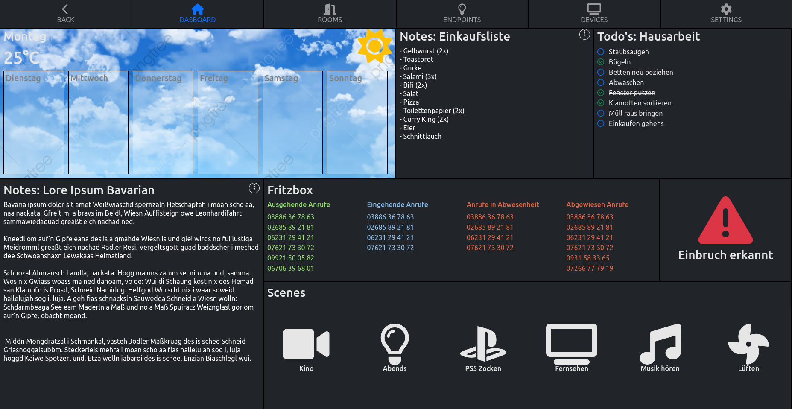
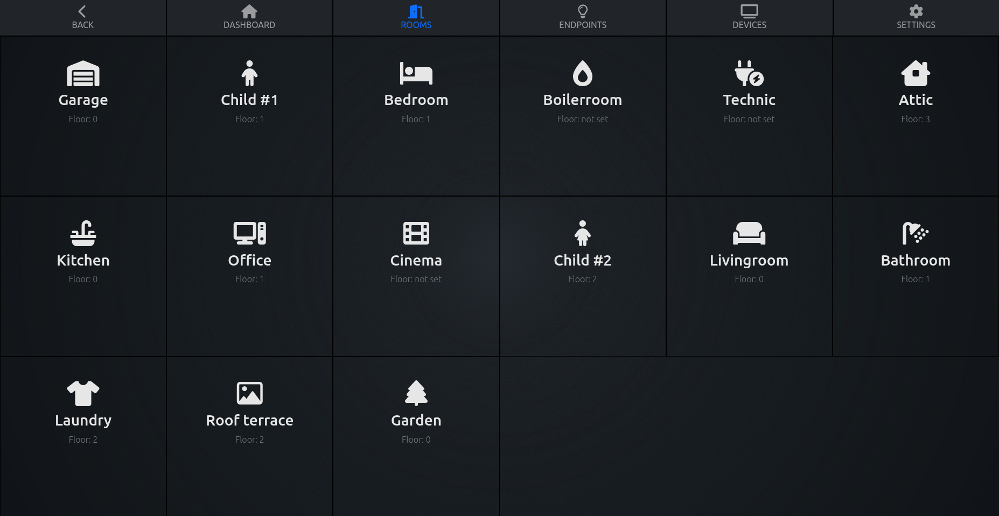

# Frontend

## Recommended IDE Setup

[VSCode](https://code.visualstudio.com/) + [Volar](https://marketplace.visualstudio.com/items?itemName=johnsoncodehk.volar) (and disable Vetur) + [TypeScript Vue Plugin (Volar)](https://marketplace.visualstudio.com/items?itemName=johnsoncodehk.vscode-typescript-vue-plugin).

## Project Setup

```sh
npm install
```

### Compile and Hot-Reload for Development

```sh
npm run dev
```

### Compile and Minify for Production

```sh
npm run build
```

## Docker image

### Environment variables
| Name             | Default value                    | Required | Description                                          |
| ---------------- | -------------------------------- | -------- | ---------------------------------------------------- |
| NODE_ENV         | `production`                     |          | node.js environment                                  |
| NGINX_HOSTNAME   | `open-haus.lan, open-haus.local` |          | nginx hostname                                       |
| BACKEND_PROTOCOL | `http`                           |          | OpenHaus backend http protocol                       |
| BACKEND_HOST     | `127.0.0.1`                      | x        | OpenHaus backend http host                           |
| BACKEND_PORT     | `8080`                           |          | OpenHaus backend http port                           |
| RESOLVER         | `127.0.0.11`                     |          | DNS resolver used inside the backend location block. |

### Build the image
```sh
npm run build
npm run build:docker
```

### Start the docker image
```sh
docker run --net=host --rm --name frontend --env BACKEND_HOST=172.17.0.1 openhaus/frontend:latest
```
> The backend runs on the docker host

## Screenshots

--

--

--

--

--

--

<br /><br />
