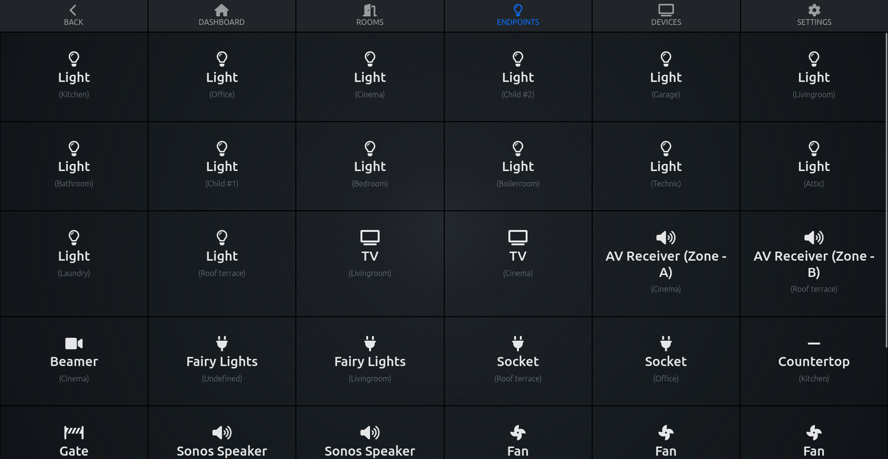
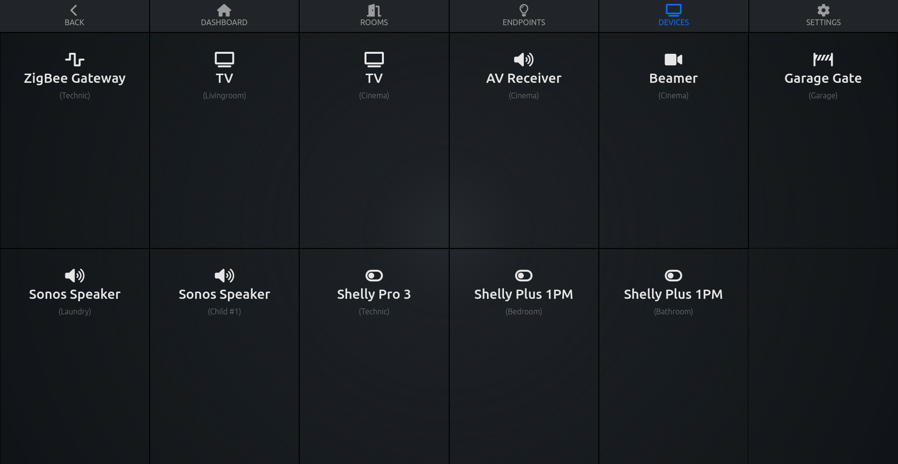

# Frontend

## Recommended IDE Setup

[VSCode](https://code.visualstudio.com/) + [Volar](https://marketplace.visualstudio.com/items?itemName=johnsoncodehk.volar) (and disable Vetur) + [TypeScript Vue Plugin (Volar)](https://marketplace.visualstudio.com/items?itemName=johnsoncodehk.vscode-typescript-vue-plugin).

## Customize configuration

See [Vite Configuration Reference](https://vitejs.dev/config/).

## Project Setup

> NOTE: You need to run the [backend](https://github.com/OpenHausIO/backend) to develop the frontend
> E.g. as [Docker Container](https://github.com/OpenHausIO/backend/blob/main/docs/DOCKER.md) or application on the host machine

```sh
npm install
```

### Compile and Hot-Reload for Development

```sh
npm run dev
```

### Compile and Minify for Production

```sh
npm run build
```


## Screenshots

--

--

--

--

<br /><br />
