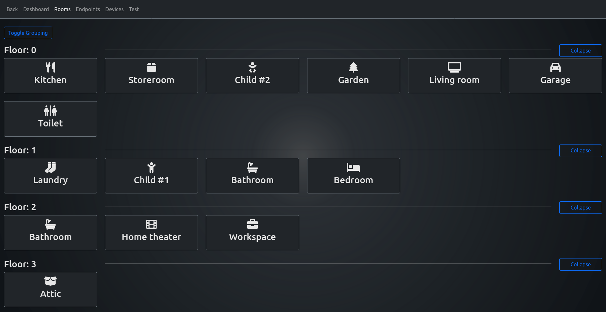

# vue-project

This template should help get you started developing with Vue 3 in Vite.

## Recommended IDE Setup

[VSCode](https://code.visualstudio.com/) + [Volar](https://marketplace.visualstudio.com/items?itemName=johnsoncodehk.volar) (and disable Vetur) + [TypeScript Vue Plugin (Volar)](https://marketplace.visualstudio.com/items?itemName=johnsoncodehk.vscode-typescript-vue-plugin).

## Customize configuration

See [Vite Configuration Reference](https://vitejs.dev/config/).

## Project Setup

> NOTE: You need to run the [backend](https://github.com/OpenHausIO/backend) to develop the frontend
> E.g. as [Docker Container](https://github.com/OpenHausIO/backend/blob/main/docs/DOCKER.md) or application on the host machine

```sh
npm install
```

### Compile and Hot-Reload for Development

```sh
npm run dev
```

### Compile and Minify for Production

```sh
npm run build
```


## Screenshots

### Rooms

Rooms are grouped by floor, they are on.
<br /><br />


Rooms ungrouped.
<br /><br />


Endpoints in a room after clicking on a room tile

---

### Endpoints

Endoints are grouped by room they are in.,
<br /><br />


Endpoints appear as they are, ungrouped.
<br /><br />


Commands a endpoint has/provide.
<br /><br />


Commands with parameters (button/enum)
<br /><br />


Commands with parameters (range)


---

### Devices

Phsyical devices, if you click on it, you see all endpoints the devices provides
<br /><br />


Available endpoints without grouping them. Room name is added to tile.
